# solve firt challenge Format-strings-vulnerability
> in PwnCollege

solve successfully challenge fmt vulnerability in pwncollege date : 03/06/2026

start write date : 04/06/2026

finshed : 

**index**

- [1.what format string and why it can vulnerability?](#1what-format-string-and-why-it-can-vulnerability)

- [2.The binary challenge](#2The-binary-challenge)

- [3.Debug and search format strings vulnerability](#3Debug-and-search-format-strings-vulnerability)

	- 3.1 Debug strcmp and check password mechanism in program

	- 3.2 Bypass strcmp with set rdi,rsi

	- 3.3 Error read and print flag

	- 3.3.1 why 0xffffffff is -1 in linux x86_64 ?

	- 3.4 searching format string vulnerability

	- 3.4.1 Why we uses fget() for testing format string vulnerability, not transmit variable into func printf?

	- 3.4.2 why before vaddr is 0x000000000000118f but breakpoint it should 0x0000555555555180?

	- 3.4.3 why rsi and rdi was drop character 't' ?

	- 3.4.3.1 debugging fgets() in program

- [4.Exploit](#4Exploit)

# 1.what format string and why it can vulnerability

- formatstring is transmit the character or sequences from local/global valriables into text/type like `%s,%c` etc. For example:

```c
#include <stdio.h>

int main(void){
	char *sequences = "ThisIsYourSequences"; //from .rodata after compiled the program
					
	printf("total: %s\nGet 1 character in squences: %c\n",

			sequences, //printf full sequences
				   
			*(sequences + 0) //because sequences + 0 = sequences[0], nature array is (arr + sizeof(type) but is vaddr need dereferent it like *(arr + sizeof(type))


			 /*	So if sequences + 0 = T then
			  *	sequences + 1 = h
			  *	sequences + 2 = i
			  *	sequences + N = character
			  *
			  *	-> because it is nature array, C basic
			  *
			  */

			); 

	return 0;
}

```

> gcc -o program program.c && ./program

result :

```
total: ThisIsYourSequences
Get 1 character in squences: T
```

**Why it can vulnerability?**

- basically, format string can is vulnerability normaly reason about wrong transmit character or sequences into type. For example :

```c
#include <stdio.h>
#include <unistd.h>

int main(void){
	
	char buffer[100];

	read(0,buffer,sizeof(buffer));
	
	printf(buffer); //Vulnerability here

	return 0;
}
```

> gcc -o program_vulnerability program_vulnerability.c && ./program_vulnerability

result like: 

```
[crokson@crokson ~]$ ./testd
%d %p %c %lx %llx
-372923392 (nil) � 0 0
[crokson@crokson ~]$ 
```

`-372923392 (nil) � 0 0` this is value leak from the stack

**how format string vulnerability work?**

- basically, the format string type %s, %d etc. It uses transmit sequences valid into printf or many functions write other. Howerver, if don't use correct many types format then appear vulnerability leak primitive, because when many write function such as printf normaly get and write sequences from valriable transmit direct into function, if it is a sequences that not problem but that is type format strings then big problem, because printf think developer transmit data/sequences into type but they don't transmit it. therefore, printf will read many datas from stack and leak many infomations/datas important like (stack canaries , bypassed many protectors mechanism, etc.) :

now see the code C here :

```c
#include <stdio.h>
#include <unistd.h>

int main(void){
	
	char buffer[100];

	read(0,buffer,sizeof(buffer));
	
	printf(buffer); /*
			^---- buffer transmit for function printf, if sequences that not problem but transmit it is:

					%d : int type format strings 4 byte
					%c : char type format strinsg 1 byte
					%llx : long long format strings 8 byte
					etc....

					big problem, because :
		when you transmit sequences like : "hello words"
											|
					   v--------------------|
				printf(); ---> printf("hello words"); -> only stdout that in terminal

		but you transmit type format strings like : %p
													|
					   v----------------------------|
				printf(); ---> printf(%p); -> leak vaddr in stack. Because printf think developer transmit vaddr into format type %p

					*/

	return 0;
}
```

**why format strings vulnerability works better in printf and write is bad?**

- basically, write() is function in unistd.h library for operating system linux, it doesn't understand type format strings such as (%s,%d,%p, etc) but printf is know him. therefore, printf leak data and write only stdout data raw out the terminal. For example :

```c
#include <unistd.h>

int main(void){
	
	char buffer[100];

	read(0,buffer,sizeof(buffer));
	
	write(1,buffer,2); // using write

	return 0;
}

```

> gcc -o program_test_write program_test_write.c && ./program_test_write

```
[crokson@crokson ~]$ gcc -o testd testd.c
[crokson@crokson ~]$ ./testd
%p
%p[crokson@crokson ~]$ 

```

- It doesn't work

# 2.The binary challenge

- this binary challenge in pwncollege, it show the stack.

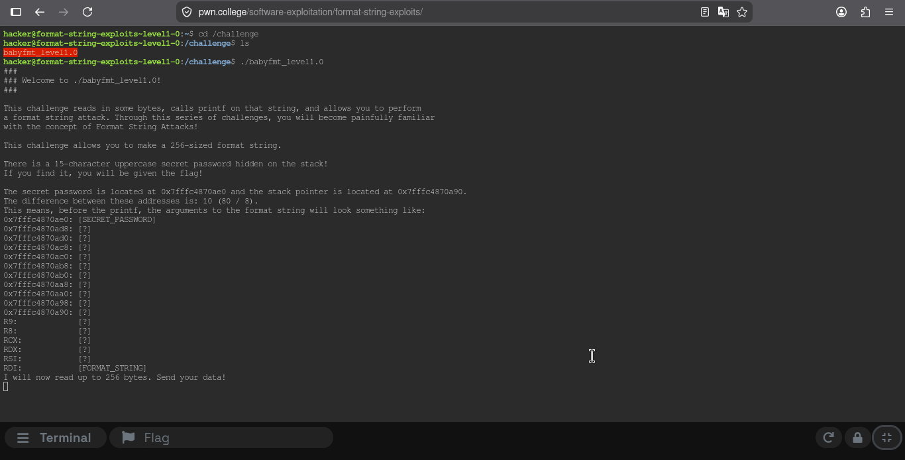

- Here, we prize it in pwncollege sandbox

# 3.Debug and search format strings vulnerability

**3.1 Debug strcmp and check password mechanism in program**

- Can understand, this is we use gdb, strace to debug it. Now, we use gdb debugger:

> gdb -q babyfmt_level1.0

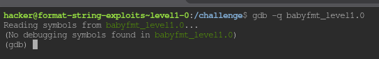

- start and disas show opcode main function

> start

and

> disas /r main

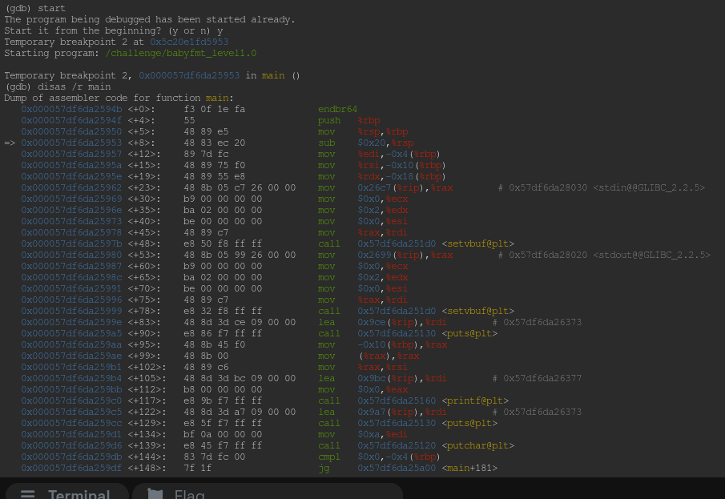

- and now, we can show code work in gdb. 

> shell ./babyfmt_level1.0

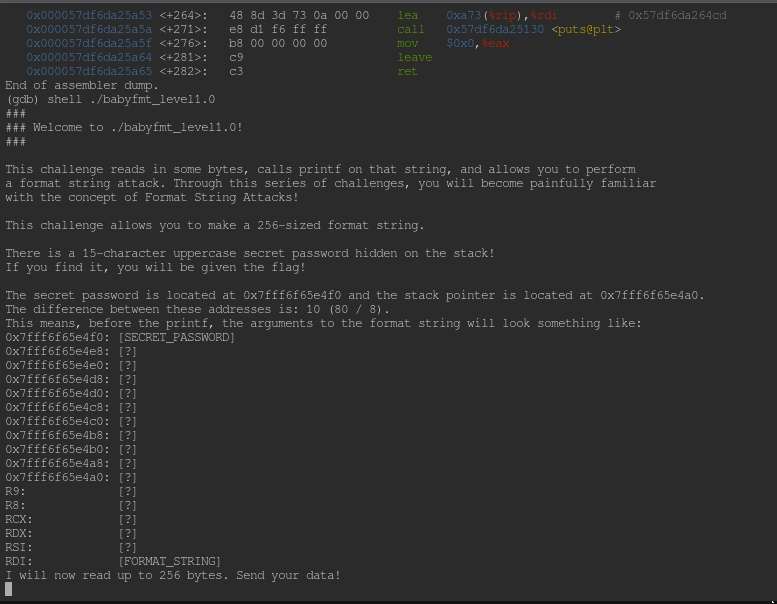

- we execute and searching vaddr in program, for understanding what is mean vaddr :

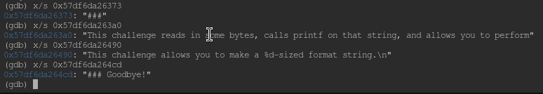

- and now show disas is :

```asm
	....
   
   0x000057df6da2599e <+83>:    48 8d 3d ce 09 00 00    lea    0x9ce(%rip),%rdi        # 0x57df6da26373 -> ###
   0x000057df6da259a5 <+90>:    e8 86 f7 ff ff          call   0x57df6da25130 <puts@plt>
   	....
   0x000057df6da259b4 <+105>:   48 8d 3d bc 09 00 00    lea    0x9bc(%rip),%rdi        # 0x57df6da26377 -> ### Welcome to %s!\n

   0x000057df6da259bb <+112>:   b8 00 00 00 00          mov    $0x0,%eax
   0x000057df6da259c0 <+117>:   e8 9b f7 ff ff          call   0x57df6da25160 <printf@plt>
   0x000057df6da259c5 <+122>:   48 8d 3d a7 09 00 00    lea    0x9a7(%rip),%rdi        # 0x57df6da26373 -> ###
   0x000057df6da259cc <+129>:   e8 5f f7 ff ff          call   0x57df6da25130 <puts@plt>
 	.......
   0x000057df6da25a33 <+232>:   48 8d 3d 56 0a 00 00    lea    0xa56(%rip),%rdi        # 0x57df6da26490 -> This challenge allows you to make a %d-sized format string.\n

   0x000057df6da25a3a <+239>:   b8 00 00 00 00          mov    $0x0,%eax
   0x000057df6da25a3f <+244>:   e8 1c f7 ff ff          call   0x57df6da25160 <printf@plt>
   0x000057df6da25a44 <+249>:   bf 0a 00 00 00          mov    $0xa,%edi
   0x000057df6da25a49 <+254>:   e8 d2 f6 ff ff          call   0x57df6da25120 <putchar@plt>
   0x000057df6da25a4e <+259>:   e8 e0 fa ff ff          call   0x57df6da25533 <func>			<-- <func> function, the logic from it?

   0x000057df6da25a53 <+264>:   48 8d 3d 73 0a 00 00    lea    0xa73(%rip),%rdi        # 0x57df6da264cd -> ### Goodbye!
   0x000057df6da25a5a <+271>:   e8 d1 f6 ff ff          call   0x57df6da25130 <puts@plt>
   0x000057df6da25a5f <+276>:   b8 00 00 00 00          mov    $0x0,%eax
   0x000057df6da25a64 <+281>:   c9                      leave
   0x000057df6da25a65 <+282>:   c3                      ret
```

- Now, we detected <func> function from vaddr `0x57df6da25533` . We think it is logic, because when program call printf print vaddr `0x57df6da26490` but last vaddr from main is `0x57df6da264cd` result is `Goodbye!`. So, can <func> is logic, now debug it:

> disas /r func

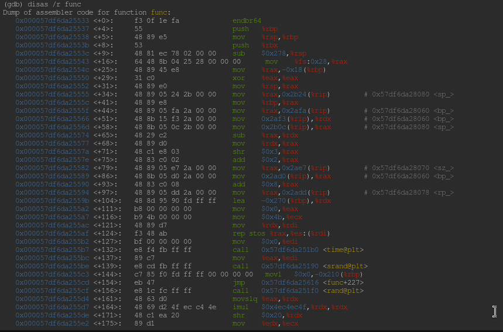

- this disas func, we see check password mechanism with strcmp and condition :

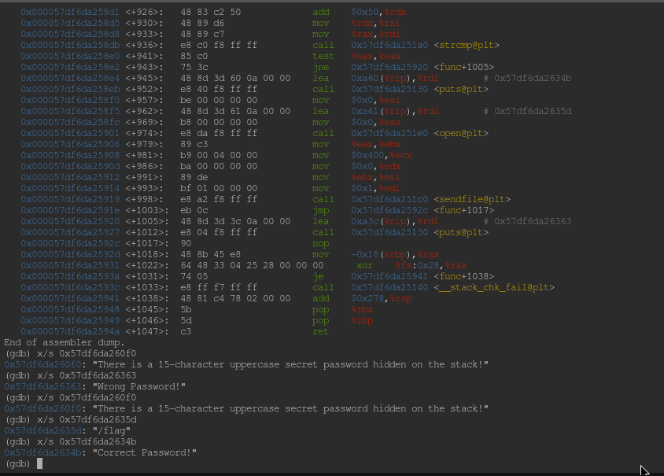

- and this :

```asm
   0x000057df6da258bb <+904>:   c6 84 05 e0 fd ff ff 00 movb   $0x0,-0x220(%rbp,%rax,1)
   0x000057df6da258c3 <+912>:   48 8b 85 d0 fd ff ff    mov    -0x230(%rbp),%rax
   0x000057df6da258ca <+919>:   48 8d 95 90 fd ff ff    lea    -0x270(%rbp),%rdx
   0x000057df6da258d1 <+926>:   48 83 c2 50             add    $0x50,%rdx  -> this +50 number into rdx

   0x000057df6da258d5 <+930>:   48 89 d6                mov    %rdx,%rsi -> arg2
   0x000057df6da258d8 <+933>:   48 89 c7                mov    %rax,%rdi -> arg1
   0x000057df6da258db <+936>:   e8 c0 f8 ff ff          call   0x57df6da251a0 <strcmp@plt> -> strcmp(rdi,rsi);

   0x000057df6da258e0 <+941>:   85 c0                   test   %eax,%eax  -> eax AND eax
   0x000057df6da258e2 <+943>:   75 3c                   jne    0x57df6da25920 <func+1005>
														 ^---.
															 |
															if((result test eax,eax) != 0){
																	jump 0x57df6da25920
															} else { continue }

														(meaning jne TRUE is ZF = 0, should can this is check mechanism. If pass correct
														 eax AND eax = 0, and incorrect eax AND eax != 0 . Basically, 1 AND 1 = 1, 0 AND 0 = 0
														What is mean?
														 basically , strcmp() if true it return 0 and failed it return 1 or number different 0
														 we have C like:

														if(strcmp(rdi,rsi) != 0){
															jump 0x57df6da25920 -> failed, pass invaild
														} else { continue })

   0x000057df6da258e4 <+945>:   48 8d 3d 60 0a 00 00    lea    0xa60(%rip),%rdi        # 0x57df6da2634b -> correct password!
   0x000057df6da258eb <+952>:   e8 40 f8 ff ff          call   0x57df6da25130 <puts@plt>
   0x000057df6da258f0 <+957>:   be 00 00 00 00          mov    $0x0,%esi
   0x000057df6da258f5 <+962>:   48 8d 3d 61 0a 00 00    lea    0xa61(%rip),%rdi        # 0x57df6da2635d -> /flag
   0x000057df6da258fc <+969>:   b8 00 00 00 00          mov    $0x0,%eax
   0x000057df6da25901 <+974>:   e8 da f8 ff ff          call   0x57df6da251e0 <open@plt> -> open /flag
   0x000057df6da25906 <+979>:   89 c3                   mov    %eax,%ebx
   0x000057df6da25908 <+981>:   b9 00 04 00 00          mov    $0x400,%ecx
   0x000057df6da2590d <+986>:   ba 00 00 00 00          mov    $0x0,%edx
   0x000057df6da25912 <+991>:   89 de                   mov    %ebx,%esi
   0x000057df6da25914 <+993>:   bf 01 00 00 00          mov    $0x1,%edi
   0x000057df6da25919 <+998>:   e8 a2 f8 ff ff          call   0x57df6da251c0 <sendfile@plt> -> can write flag?
   0x000057df6da2591e <+1003>:  eb 0c                   jmp    0x57df6da2592c <func+1017>
   0x000057df6da25920 <+1005>:  48 8d 3d 3c 0a 00 00    lea    0xa3c(%rip),%rdi        # 0x57df6da26363 -> wrong password!
   0x000057df6da25927 <+1012>:  e8 04 f8 ff ff          call   0x57df6da25130 <puts@plt>

		|  (after print wrong password, program will check stack canaries and exit)
		v

   0x000057df6da2592c <+1017>:  90                      nop
   0x000057df6da2592d <+1018>:  48 8b 45 e8             mov    -0x18(%rbp),%rax
   0x000057df6da25931 <+1022>:  64 48 33 04 25 28 00 00 00      xor    %fs:0x28,%rax
   0x000057df6da2593a <+1031>:  74 05                   je     0x57df6da25941 <func+1038>
   0x000057df6da2593c <+1033>:  e8 ff f7 ff ff          call   0x57df6da25140 <__stack_chk_fail@plt>
   0x000057df6da25941 <+1038>:  48 81 c4 78 02 00 00    add    $0x278,%rsp
   0x000057df6da25948 <+1045>:  5b                      pop    %rbx
   0x000057df6da25949 <+1046>:  5d                      pop    %rbp
   0x000057df6da2594a <+1047>:  c3                      ret
```

- Right, the program check password with strcmp and use condiction check if strcmp return 0 then successfuly password is correct and if return 1 or number !=0 then failed, password is incorrect. 

- Because working in ssh shell in pwncollege online, it slowing and unstabling. We should install the binary challenge from pwncollege server to my operation system for debugging local. Use script :

```bash
#!/bin/bash

# 1. Kiểm tra đầu vào
if [ -z "$1" ]; then
    echo "Sử dụng: ./get_pwn.sh <tên-challenge>"
    echo "Ví dụ: ./get_pwn.sh syscall-shenanigans"
    exit 1
fi

RAW_NAME=$1
KEY_PATH="./key" # File key nằm ở thư mục hiện tại
HOST="hacker@dojo.pwn.college"

# 2. Xử lý đổi tên: syscall-shenanigans -> SyscallShenanigans
FOLDER_NAME=$(echo "$RAW_NAME" | awk -F'-' '{for(i=1;i<=NF;i++) printf "%s%s", toupper(substr($i,1,1)), substr($i,2); print ""}')

# Backup an toàn: Nếu folder name bị rỗng vì lý do nào đó, dùng luôn tên gốc
if [ -z "$FOLDER_NAME" ]; then
    FOLDER_NAME=$RAW_NAME
fi

echo "[+] Đang tạo thư mục: $FOLDER_NAME"
mkdir -p "$FOLDER_NAME"
# Di chuyển vào thư mục vừa tạo. Nếu lỗi thì dừng luôn script!
cd "$FOLDER_NAME" || { echo "[-] Lỗi: Không thể vào thư mục $FOLDER_NAME"; exit 1; }

# 3. Danh sách các file cần "vét" từ server
echo "[+] Đang tải từ server về..."

# Lưu ý: Vì ta đã chui vào trong folder con, đường dẫn tới file key phải lùi lại 1 bậc (../$KEY_PATH)

echo "  -> Tải file challenge..."
scp -i "../$KEY_PATH" "$HOST:/challenge/$RAW_NAME" "./$RAW_NAME"

echo "  -> Tải Libc..."
scp -i "../$KEY_PATH" "$HOST:/lib/x86_64-linux-gnu/libc.so.6" "./libc.so.6"

echo "  -> Tải Loader (ld)..."
scp -i "../$KEY_PATH" "$HOST:/lib64/ld-linux-x86-64.so.2" "./ld.so"

echo "  -> Tải libcapstone.so.5..."
# Đường dẫn ĐÃ ĐƯỢC CẬP NHẬT
scp -i "../$KEY_PATH" "$HOST:/lib/libcapstone.so.5" "./libcapstone.so.5"

# Cấp quyền thực thi
chmod +x "$RAW_NAME"

echo "------------------------------------------------"
echo "[OK] Đã gom toàn bộ vào thư mục: $FOLDER_NAME/"
ls -l
echo "------------------------------------------------"

echo "[+] Đang 'vá' (patch) binary để chạy được ở local..."
# 1. Bảo binary dùng ld.so ở thư mục hiện tại
patchelf --set-interpreter ./ld.so "./$RAW_NAME"

# 2. Bảo binary tìm libc và libcapstone ở thư mục hiện tại
patchelf --set-rpath . "./$RAW_NAME"

echo "------------------------------------------------"
echo "[OK] ĐÃ XONG! Giờ bạn có thể chạy bằng lệnh:"
echo "     ./$RAW_NAME"
echo "------------------------------------------------"

```

> Based on a script provided by kgf95983 [pwn.], modified by me.

result after use `./get_pwn.sh` :

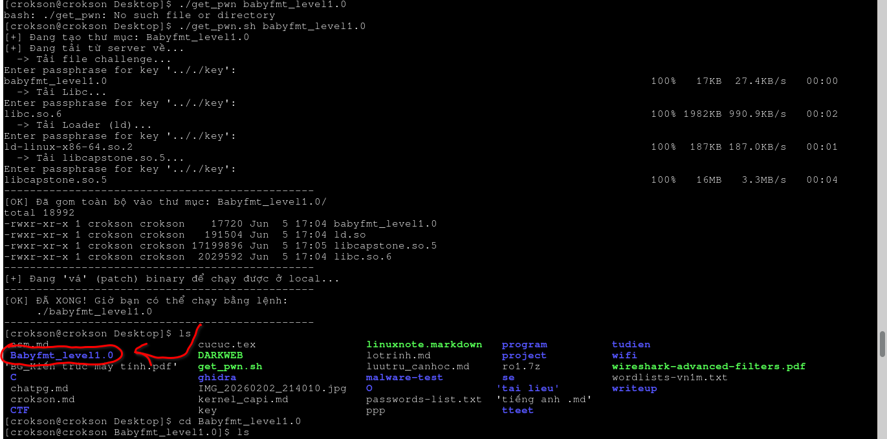

And now, we can until or breakpoint to vaddr `0x000057df6da258bb` for debugging

- because, before my computer interupt reason is no enegry for him. Should, **vaddr will changed**, here I think say is "until or break into `movb   $0x0,-0x220(%rbp,%rax,1)` ", we use until command in GDB :

> until *0x00005555555558bb #this is vaddr new, after interupt my computer. But, it doesn't changed the logic in func

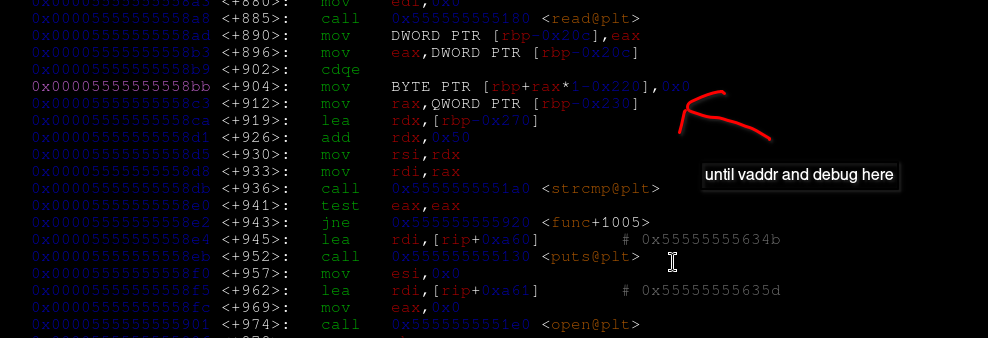

After, it showing mechanism read `..send your data` and `type secret password`, I type `skip` for it.

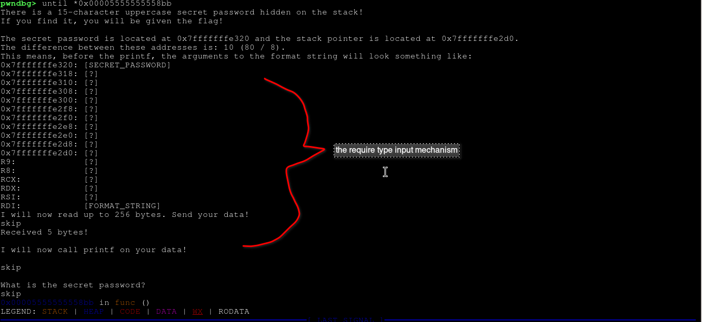

hmm, skip saved in rsi register transmit to strcmp().

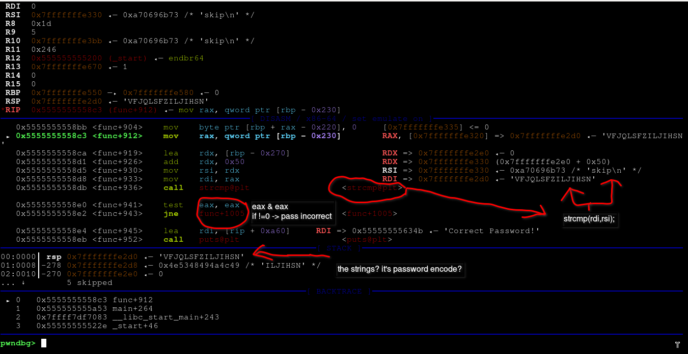

**3.2 Bypass strcmp with set rdi,rsi**

and now, what happend when we execute until to strcmp() and try hook `set $rsi = $rdi`, it can bypassed and output is flag?

> until *0x5555555558db

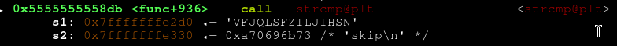

> set $rsi = $rdi

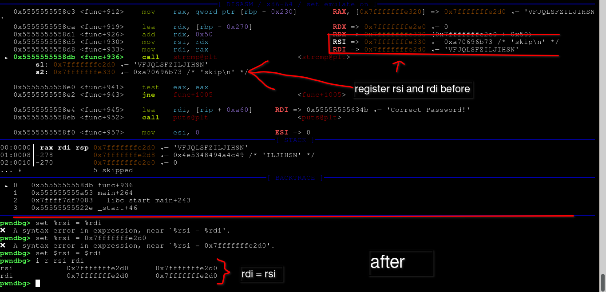

right, now register rdi and rsi is vaddr `0x7fffffffe2d0`. So, we try execute strcmp() and see what happend :

> ni

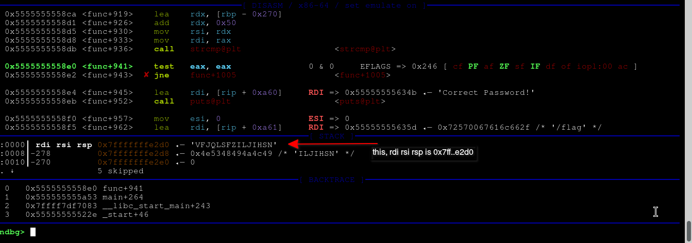

it works, `0 & 0 = 0` but it doesn't print flag if you don't belive? we continue use `ni` and debug it :

> ni

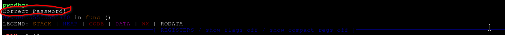

this is print text `correct password`

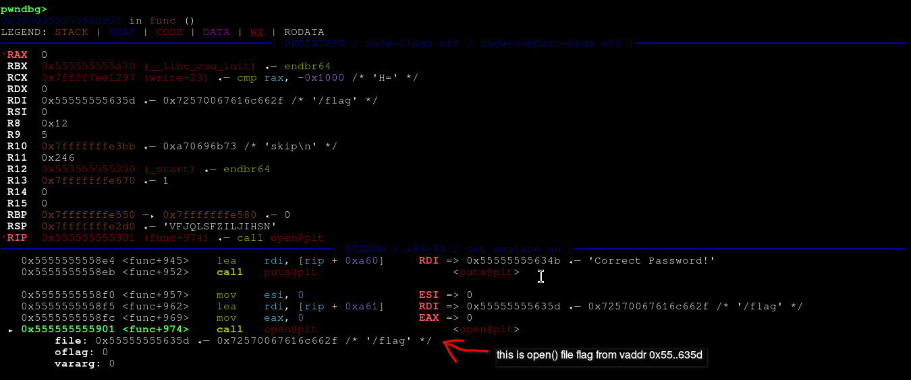

this is open the file flag, from vaddr `0x55555555635d`

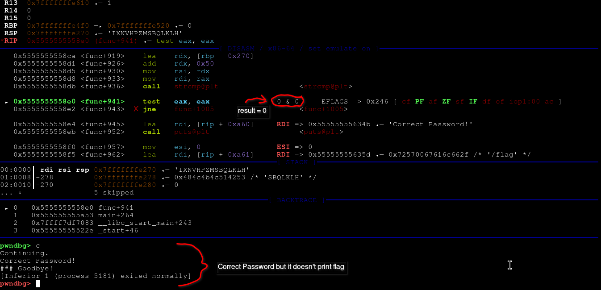

this correct password but it doesn't flag. We debug it terminal in pwncollege, result not changed :

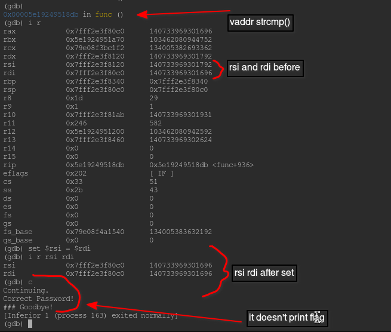

**3.3 Error read and print flag**

> Why does the program print "Correct Password!" but still not show the flag??

- my local operation system

it doesn't print flag because I don't create a file flag in path `/`. When strcmp() executed and return is `0`, I bypassed the password but when instrution function open() open file `/flag` it doesn't find file because file. Therefore, when open() executed failed it returns error code normally is `-1`. 

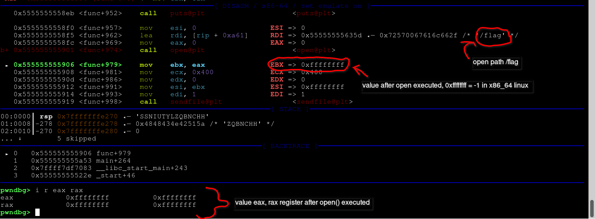

**3.3.1 why 0xffffffff is -1 in linux x86_64 ?** : because eax is signeds int return value of open().

ez better with strace :

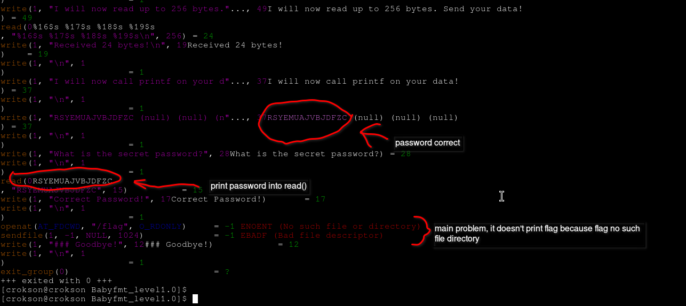

So, exetaly error is `/flag no such file` should dont open it. So, What happend if we create file `flag` in `/`? :

> echo "This is flag : Q.Hao{...this...flag....code...}" > flag && sudo mv flag /

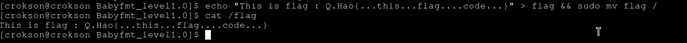

and now, we will restart and run program with gdb :

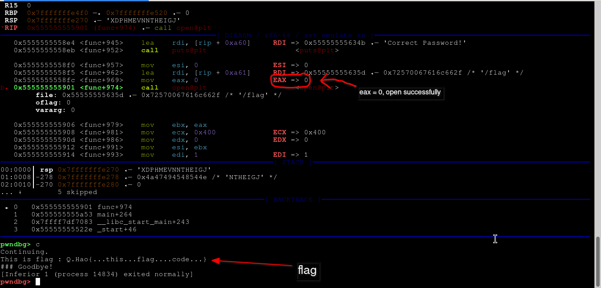

flag will print, because open successfully file `/flag`

**3.4 searching format string vulnerability**

- we will create two files (`using_printf_safe.c` and `using_printf_wrong.c`) :

```c
//using_printf_safe.c
#include <stdio.h>

int main(void){
	char nah[100];
	fgets(&nah,sizeof(nah),stdin);
	printf("%s",
			nah //transmit valriable into printf
	);

	return 0;
}
```

and :

```c
//using_printf_wrong.c
#include <stdio.h>

int main(void){
	char nah[100];
	fgets(&nah,sizeof(nah),stdin);
	printf(nah); //vulnerability

	return 0;
}
```

> gcc -o safe using_printf_safe.c && gcc -o vuln using_printf_wrong.c

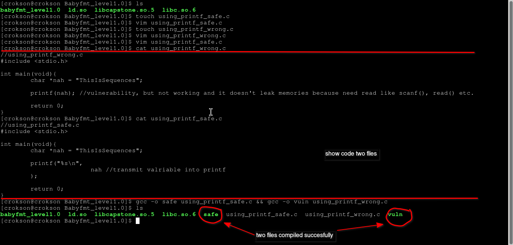

**3.4.1 Why we uses fget() for testing format string vulnerability, not transmit variable into func printf?**

- Normally, nature format strings vulnerability is vuln can exploit it when `attackers control plaintext transmit into printf` for example :

```c
//using_printf_wrong.c
#include <stdio.h>

int main(void){
	char *nah = "quanghao_formatstring";
	
	printf(nah); //but not working and it doesn't leak memories because need read like scanf(), read() etc. Or need strings syntax like : %s %p etc.

	return 0;
}
```

Or :

```c
//using_printf_wrong.c
#include <stdio.h>

int main(void){
	char *nah = "quanghao_formatstring";
	
	printf("%s\n",nah); //disas is puts(), transmit it is rdi register not rsi or different register. Because, compiler optimizated it when compiled the program

	return 0;
}
```

now, we lets debug it with gdb :

> gdb -q safe

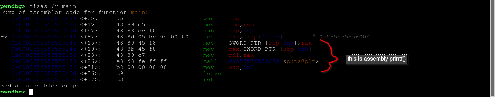

and we breakpoint vaddr `0x0000555555555199` :

> b *0x0000555555555199

and this:

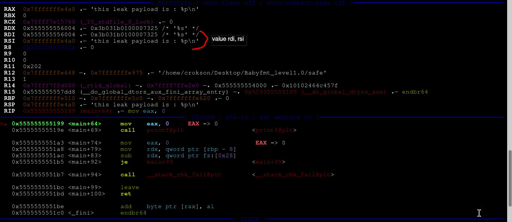

and now, we `ni` it. Instrution printf will executed :

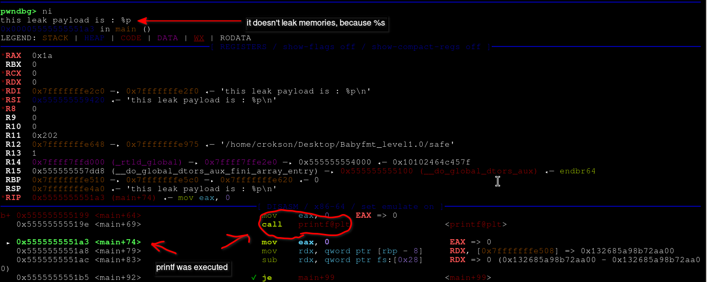

result is `%p` dont leak the memories reason is `"%s"`

- Now, we debug next for `using_printf_wrong.c`

> gdb -q vuln

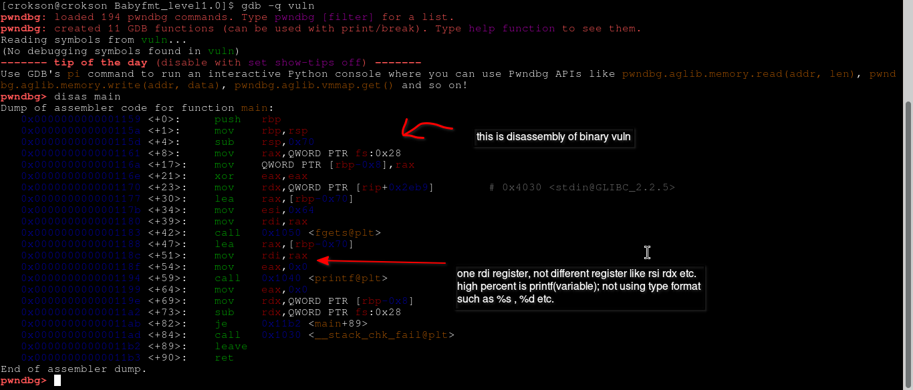

- from disassembly, we seeing is prgram was registered is one rdi, not have different register is rsi, rdx etc. therefore, program was used is `printf( argument 1 );`. Howerver, exatly better we will run and debug how program executing and working with plaintext input, We will breakpoint from `0x0000555555555180` before fgets was executed:

> b *0x0000555555555180

**3.4.2 why before vaddr is 0x000000000000118f but breakpoint it should 0x0000555555555180?** : because 0x000000000000118f is vaddr default in program binary static not runtime should break 0x000000000000118f then failed because wrong vaddr, and 0x0000555555555180 is vaddr when program running if we break 0x0000555555555180 then it working because this is vaddr have program runtime not static

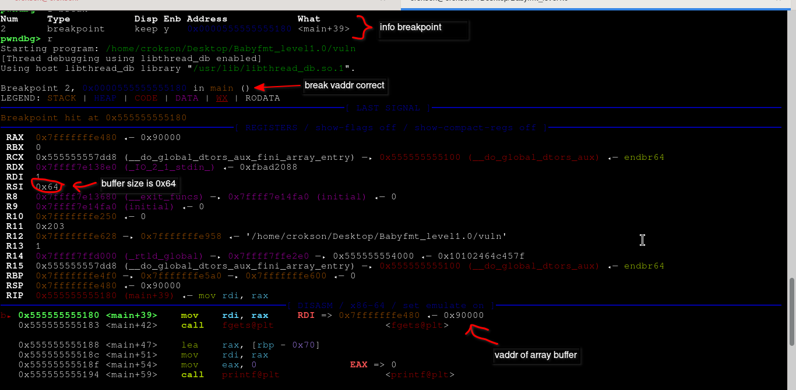

and now, we start using `ni` for programing executing to fgets(), and print input is `this is leak memories is : %p` and look it have leaked the stack, memories ? :

> ni

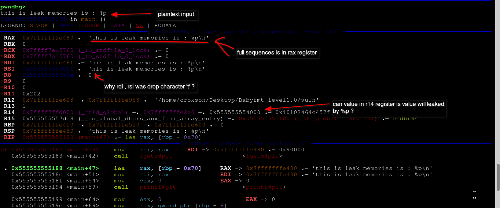

**3.4.3 why rsi and rdi was drop character 't' ?** : because see vaddr `0x7fffffffe481` in RDI register and vaddr `0x7fffffffe480` in rax register, this is it plus one byte for virtualling address like :

```
0x7fffffffe480 = "this is leak memories is : %p\n"	 }	this is arithmetic pointer, this is char, char one byte ( 1byte ) should it plus 1 byte in 
0x7fffffffe481 = "his is leak memories is : %p\n"	 }  vaddr :  	char *pointer = "hello words\n";
0x7fffffffe482 = "is is leak memories is : %p\n"     }				pointer += 1 ; //ello words\n
```

**3.4.3.1 debugging fgets() in program**

So, why it does it? : because fgets() in libc logic is reason. Now, we lets debug it:

> b *fgets

and

> r

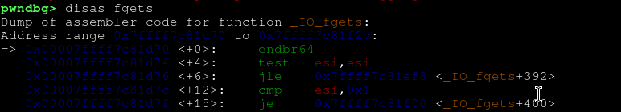

this is disassembly for fgets() function. We think, should break continue for vaddr `0x00007ffff7c81e07` to `__GI__IO_getline` function, because `__GI__IO_getline` because `_IO_fgets` function, it's mission gets argument, data, etc and transmit into `__GI__IO_getline` and add null byte in last sequences. 

#4.Exploit
