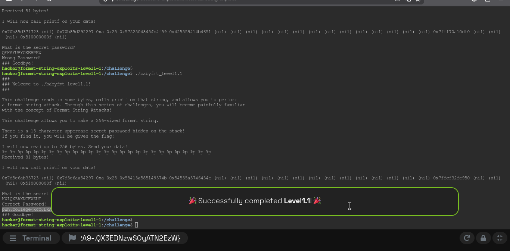
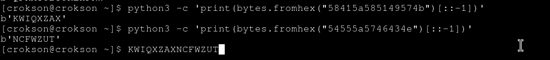

# Ghi chú kiến thức

khi leak 1 vaddr khả nghi là ascii code, chúng ta thường little edian toàn bộ chuỗi ví dụ

leak : 0x58415a585149574b và 0x54555a5746434e

chúng ta ghép chuỗi lại thành 0x58415a585149574b54555a5746434e và little edian thành chuỗi NCFWZUTKWIQXZAX đó là sai

cách đúng là little edian từng cái và ghép chúng liền mạch ví dụ :

0x58415a585149574b : KWIQXZAX (1)
0x54555a5746434e : NCFWZUT (2)

từ (1) và (2) -> ghép lại : KWIQXZAXNCFWZUT -> pass đúng

