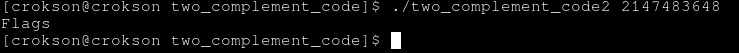

## Writeup: Two complement code 2

**index**

- 1.the tmax in condiction

- 2.input and print flags

---

# 1.the tmax in condiction

- here `if((unsigned int)x > INT_MAX)` , INT_MAX is tmax of int `01111..<32bits>..` but input number > tmax is condiction true and print flags

# 2.input and print flags

- input number > 2147483647 is 2147483648

