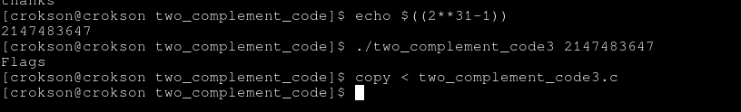

## Writeup : Two complement code 3

**index**

- 1.why it's signed overflow Tmax but doesn't work after compiled?

- 2.Debug

- 3.Config and try again new code
---

# 1.why it's signed overflow Tmax but doesn't work after compiled?

- Compiler was optimized when compiling the program, It knew condiction1 will false and condiction2 will !(true). Here, it's possible in CPU architecture but not in C law because it UB and compiler working in C law

# 2.Debug

- ghidra show:


- Looked it optimized by compiler, should it doesn't print flags.

# 3.config and try again new code

```c
#include <stdio.h>
#include <limits.h>
#include <stdlib.h>

int number_checker(char *number){
	if(*number == '\0'){return -1;}
	
	while(*number){
		if(*number < '0' || *number > '9'){
			return 1;
		}
		*number++;
	}
	return 0;
}

int main(int argc, char **argv){
	if(argv[1] == NULL) return -1;

	if(number_checker(argv[1]) == 1) return -1;

	int x = atoi(argv[1]);
	int flags = 0;

	__asm__ __volatile__(
		"movl %[x], %%eax\n\t"
		"addl $1, %%eax\n\t"
		"cmp %[x], %%eax\n\t"
		"jl 1f\n\t" // if (x + 1 < x)
		"jmp 2f\n\t"
		"1:\n\t"
		"movl $1, %[flags]\n\t"
		"2:\n\t"
		: [flags] "+r"(flags)
		: [x] "r"(x)
		: "eax", "cc"
	);

	if(flags == 1){
		printf("Flags\n");
		return 0;
	}
	
	printf("thanks\n");
	return 0;
}
```

Code with assembly, basicially compiler doesn't optimizited it. Should, executed with CPU architecture and possible from overflow

> gcc -o two_complement_code two_complement_code.c

now type Tmax 32bits into it:



worked