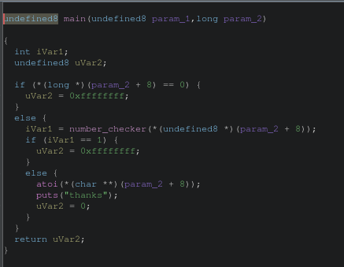

## Writeup : Two complement code 3

**index**

- 1.why it's signed overflow Tmax but doesn't work after compiled?

- 2.Debug

---

# 1.why it's signed overflow Tmax but doesn't work after compiled?

- Compiler was optimized when compiling the program, It knew condiction1 will false and condiction2 will !(true)

# 2.Debug

- ghidra show:

- Looked it optimized by compiler, should it doesn't print flags