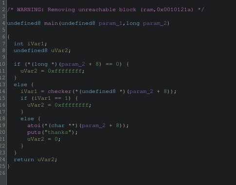
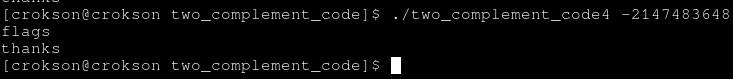
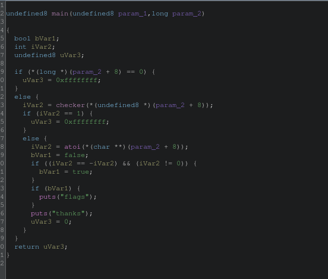

## Writeup: two complement code 4

**index**

- 1.Why we replace condiction to assembly inline GCC?

- 2.print Tmin into program and get flags

---

# 1.Why we replace condiction to assembly inline GCC?

- Because, when using condiction C in program it's optimized by compiler. Proof:

So it always printing sequences with puts()

# 2.print Tmin into program and get flags

- Tmin of it's `-2147483648`, because it 32bits

Worked, It's `x == Tmin && -x == x` condiction

Program reverse after compiled