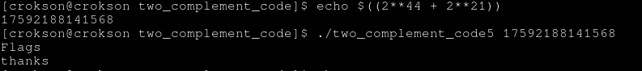

## Writeup : two complement code 5

**index**

- 1.The truncation type

- 2.generating values and get flags

---

# 1.The truncation type

- truncation type when type casting from int to short or casting long to long long etc. When type casting, many bits binaries in type will truncation for example int 32bits `000000..<32bits>` and short 16bits `000000..<16bits>` when casting int to short, its cut binaries to 16bits and when casting type short to int, its using zero or sign extension custom from MSB bits to 32bits

# 2.generating values and get flags

- genarating values number, we need using 64bits binaries from here:

```
00000000000000000001000000000000 | 00000000001000000000000000000000
^^^^^^^^^^^^^^^^^^^^^^^^^^^^^^^^   ^^^^^^^^^^^^^^^^^^^^^^^^^^^^^^^^
	32 bits								32bits
```

when casting from long long to int then its was cutted 32bits high like:

```
00000000001000000000000000000000	(32bits for int after cut 32bits)
^^^^^^^^^^^^^^^^^^^^^^^^^^^^^^^^
	32 bits						
```

and when casting from int to long long, its will zero extension 32bits because MSB = 0


```
00000000000000000000000000000000 | 00000000001000000000000000000000
^^^^^^^^^^^^^^^^^^^^^^^^^^^^^^^^   ^^^^^^^^^^^^^^^^^^^^^^^^^^^^^^^^
	32 bits	zero extension						32bits
```

and different value `0000000000000000000000000000000000000000001000000000000000000000` != `0000000000000000000100000000000000000000001000000000000000000000` should it return TRUE and print flags.

And now We start caculating its, knew bits 1 firt is 44 from location bits and bits 1 continue is 21 from locatio bits

```
0000 0000000000 00000 1(44) 0000 0000000000 00000000 1(21) 000000000000000000000
```

| location bits | 44 | 21 |
|---------------|----|----|
| $$\large2^{N}$$ | 17592186044416 | 2097152 |

- `17592186044416 + 2097152 = 17592188141568` this is result is value correct.



worked
