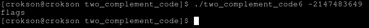

## writeup: two complement code 6

**index**

- 1.what's `x ^ (x << 1)` mathematical operation?

- 2.Analysis and type payload and get flags

---

# 1.what's x ^ (x << 1) mathematical operation?

- x^(x << 1) is a mathematical operation checking MSB bit and bit next different, for example `0100 = 0100 ^ (0100 << 1) = 0100 ^ 1000 = 1100` if MSB = 1 after xor mathematical operation is true meaning is MSB and bit next different and if MSB = 0 after mathematical operation is false meaning is MSB and bit next not different

# 2.Analysis and type payload and get flags

- here comparison condiction is ` < 0` should we need caculating for bit MSB = 1 meaning negative number and its can return true and flags because `<negative number> < 0`. here we have `x ^ (x << 1)` mathenatical oparation, we caculating bit so that the result is negative number. We use Tmax:

```
Tmax 32bits = 2147483647 bit is :

01111111111111111111111111111111

```

now, we using xor mathematical operation :

```
01111111111111111111111111111111 << 1 = 11111111111111111111111111111110

01111111111111111111111111111111 ^ 11111111111111111111111111111110 = 10000000000000000000000000000001
```

we lets caculating value bits `10000000000000000000000000000001` 32 bits is location bits is $$\large\in$$ [0, 31], should MSB bit location is 31 and LSB bit is 0

| location bits | 31 | 0 |
|---------------|----|---|
| $$\large2^{N}$$ 		| 2147483648 | 1 |

result is `2147483648 + 1 = 2147483649 -> -2147483649 (because MSB = 1 should its negative numbers)`

