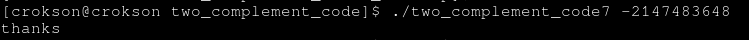
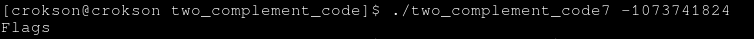

## Writeup : two complement code 7

**index**

- 1.What's bit Carry and CF ?

- 2.Generating and gets flags

---

# 1.What's bit Carry and CF?

- bit carry is storage area many bits out of bound of binary, CF is a flag progress bit carry is yes or no

# 2.Generating and gets flags

- generating negative numbers:

For binary likes:

```
1000 + 1000 = 0000 (1 carry)
```

but negative numbers when bit MSB = 1 :

```
0100 + 1000 = 1100 = -4

unsigned = 12 > Tmax 4bits 0111 
```

should similarly with 32bits

```
negative numbers such as -2147483648 = 10000000000000000000000000000000 :

10000000000000000000000000000000 + 10000000000000000000000000000000 = 00000000000000000000000000000000

00000000000000000000000000000000 + 2 = 00000000000000000000000000000010 = 2 < -2147483648 = False
```



try again:

```
numbers such as -1073741824 = 11000000000000000000000000000000 

11000000000000000000000000000000 + 11000000000000000000000000000000 = 10000000000000000000000000000000 -> 1 carry

10000000000000000000000000000000 + 2 = 10000000000000000000000000000010 = -2147483646 < -1073741824 and 2147483650 > Tmax = TRUE and print flags
```



Or easy better is mathematical operating negative plus negative for example: 

```
-1 + -1 = -2
1 + -1 = 0
ez math
```

now

```
x + x + 2 < x = -10 + -10 = -20 + 2 = -18 < -10 -> TRUE

And if it type casting is unsigned then number -18 -> unsigned = very large = true
```