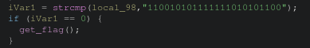

# Writeup : hexa chall 1

**mục lục**

- 1.ghidra phân tích và phép so sánh checking strcmp()

- 2.quy đổi, tạo payload và lấy flags

---

## 1.ghidra phân tích

- mở ghidra ta thấy :

- phép so sánh binary và ta biết kết quả

## 2.quy đổi, tạo payload và lấy flags

xét vị trí bit :

| vị trí bit  | 23 | 22 | 21 | 20 | 19 | 18 | 17 | 16 | 15 | 14 | 13 | 12 | 11 | 10 | 9 | 8 | 7 | 6 | 5 | 4 | 3 | 2 | 1 | 0 |
|-------|-|-|-|-|-|-|-|-|-|-|-|-|-|-|-|-|-|-|-|-|-|-|
| bit | 1 | 1 | 0 | 0 | 1 | 0 | 1 | 0 | 1 | 1 | 1 | 1 | 1 | 1 | 1 | 0 | 1 | 0 | 1 | 0 | 1 | 1 | 0 | 0 |