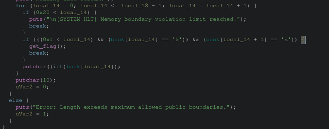
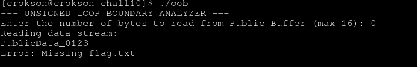

# writeup : chall10

**mục lục**

- 1.OOB (out of round) là gì?

- 2.vòng lặp trong chương trình

- 3.condition trong chương trình 

- 4.generating payload và lấy flags 

---

## 1.OOB (out of round) là gì?

- là vượt quá giới hạn của cái gì đó, phổ biến ở mảng trong C. Có hai cái:

	- 1.là oob read : phần này chỉ leak các info ra

	- 2.là oob write : phần này là ghi đè vào luôn

## 2.vòng lặp trong chương trình

ghidra show :

ta có : `for (local_14 = 0; local_14 <= local_18 - 1; local_14 = local_14 + 1)`, nguyên nhân của OOB là đây. Local_18 - 1 nếu có số nhỏ hơn sẽ là vòng lặp cực lớn hơn nữa local18 lại là unsigned, nên MSB = 1 sẽ là số rất cao. Nếu đây ko phải OOB thì cũng là lỗi logic

## 3.condition trong chương trình 

- cũng ở trong hình ảnh trên, ta có : `if (((0xf < local_14) && (bank[local_14] == 'S')) && (bank[local_14 + 1] == 'E')`, chưa thể kết luận là bank nó bao nhiêu nhưng OOB rõ. Lỗi logic ở vòng for suy ra số lớn vào là tỷ lệ cao nó sẽ như brute force dò và leak một loạt các bộ nhớ, rồi nó đúng dần và thực thi

## 4.generating payload và lấy flags 

- kết quả input : 0 (do unsigned, xpl cái bug logic for tràn tiếp cho oob vì 0 - 1 = -1 là Umax)

