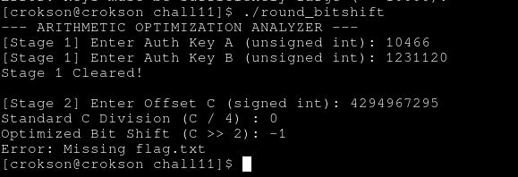

# writeup : chall11

**mục lục**

- 1.dịch bit là gì?

- 2.phân tích condition và phép toán

- 3.dùng script C optimizited tính toán nhân

- 4.dọn dẹp dòng code còn lại

- 5.Generating và lấy flags

---

## 1.dịch bit là gì?

- là khái niệm dịch sang trái/phải ở binary string, ví dụ `0b001100110 << 1 = 0b011001100 (tương đương nhân 2)`, `0b001100110 >> 1 = 0b000110011 (tương đương chia 2)`

## 2.phân tích condition và phép toán

ghidra show:


ta có : `if ((local_28 < 10000) || (local_24 < 10000))`, phải bằng hoặc lớn hơn `10000` và `if (local_1c == 0x20)` tính phép nhân cho bằng `0x20 = 32` ở đây là số lớn hệ ko dấu, ta cần làm tràn Umax mới có thể tới số nhỏ hơn

## 3.dùng script C optimizited tính toán nhân

- là script `caculating_local_1c.c`


kết quả tính toán được, nhập thử:


qua ải 1

## 4.dọn dẹp dòng code còn lại

code clean :

```c
		int iVar1,local_20;
		unsigned int local_18;

          iVar1 = scanf("%d",&local_20);
          if (iVar1 == 1) {
            iVar1 = local_20;
            if (local_20 < 0) { //i guess: ko phải ngẫu nhiên mà lại có cái này
              iVar1 = local_20 + 3;
            }
            local_18 = iVar1 >> 2; //ví dụ : 000011, phải ở LSB và bit kế bên
            local_14 = local_20 >> 2; //chắc chắn phải là -1, UMAX

            if ((local_18 == 0) && (local_14 == 0xffffffff)) {
              get_flag();
			}
```

## 5.Generating và lấy flags

- dựa vào code trên ta có local_20 và ivar1 là signed, cho input = `-1`, tới ải công 3. Binary = 000010 (1carrry), toán học = -1 + 3 = 2, tới ải local18, binary 000010 >> 2 = 000000, tới ải local14 vẫn là -1 vì trong bù hai việc **shift Umax vẫn là chính nó** nên kết quả là `-1`

