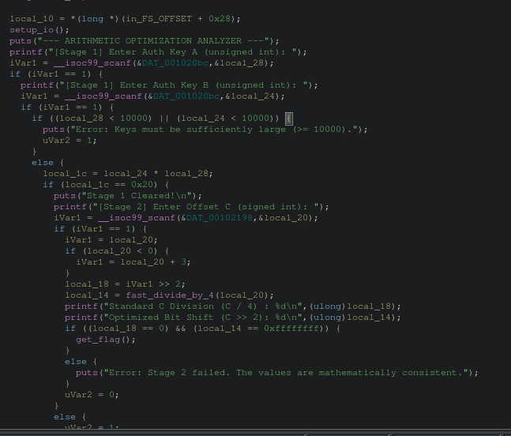
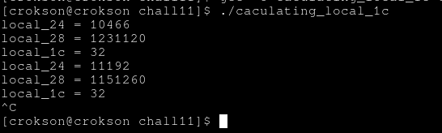
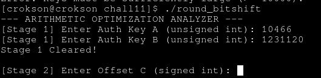

# writeup : chall11

**mục lục**

- 1.dịch bit là gì?

- 2.phân tích condition và phép toán

- 3.dùng script C optimizited tính toán nhân

- 4.

---

## 1.dịch bit là gì?

- là khái niệm dịch sang trái/phải ở binary string, ví dụ `0b001100110 << 1 = 0b011001100 (tương đương nhân 2)`, `0b001100110 >> 1 = 0b000110011 (tương đương chia 2)`

## 2.phân tích condition và phép toán

ghidra show:

ta có : `if ((local_28 < 10000) || (local_24 < 10000))`, phải bằng hoặc lớn hơn `10000` và `if (local_1c == 0x20)` tính phép nhân cho bằng `0x20 = 32` ở đây là số lớn hệ ko dấu, ta cần làm tràn Umax mới có thể tới số nhỏ hơn

## 3.dùng script C optimizited tính toán nhân

- là script `caculating_local_1c.c`

kết quả tính toán được, nhập thử:

qua ải 1