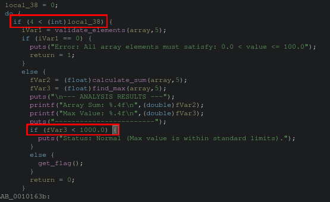
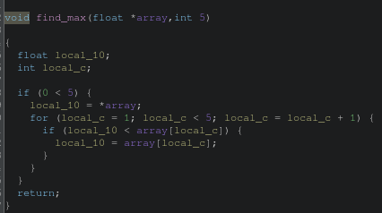
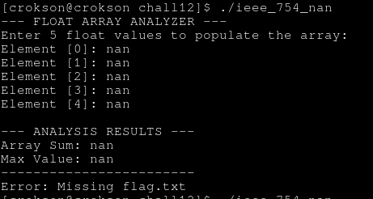

# WriteUp : giải bài ieee 754 nan

**mục lục**

- NaN là gì

- Scanf nhận gía trị gì ngoài số thực?

- phân tích condiction và các thuật toán

- Cung cấp payload và lấy flag.

---

## 1.NaN là gì

- NaN là một giá trị đặc biệt biểu thị cho khi decode ko có dấu chấm ở phần số thực nghĩa là trường exponent max là bit 1 hết cả điều kiện xảy ra NaN :

| sign | exponent | fraction |
|------|----------|----------|
| S | 11111111 | $$\large\neq0$$ |

## Scanf nhận gía trị gì ngoài số thực?

- Ngoài nhận các số thực biểu diễn dưới `x.x` nó còn nhận các ký hiệu đặc biệt như `nan`, `NaN`, `NAN`, `+nan`, `-nan`, `inf`, `infinity`, `-INF`. Điều này giúp cho việc cung cấp input với trường hợp như chall này là NaN sẽ ko thể biểu diễn dưới dạng một số thực nhất định, nó sẽ được thiết lập theo sơ đồ ví dụ như trên

## phân tích condiction và các thuật toán

- chúng ta tiến hành phân tích condiction trước

theo như tỏng ghidra chúng ta thấy có vài condiction ví dụ như `if (4 < (int)local_38) ` cái này để kiểm tra và giới hạn sao cho chương trình đọc đầu vào đủ 5 lần theo từ `0,1,2,3,4` để lưu vào mảng vì chương trình có đang chạy vòng lặp vô hạn ở phần này. Điều kiện số hai là quyết định in flag hay ko đó là `if (fVar3 < 1000.0) ` ở đây để in được flag ta phải có `fVar3 < 1000.0`

Tiếp theo chúng ta phân tích thuật toán `find_max()`

tại phần này, nó tạo điều kiện so sánh và vòng lặp 5 lần theo như cái input lúc đầu chương trình đọc. Mục đích của thuât toán này là tìm số thực lớn nhất trong tập hợp số thực được cung cấp vào trong mảng nếu có số thực trong mảng lớn hơn số thực đã được duyệt trước đó nó sẽ xung đột với câu điều kiện và trả về false xong kết thúc hàm lệnh

## Cung cấp payload và lấy flag.

- Payload nào có thể giúp lớn hơn 1000.0 trong khi đó chương trình chỉ cho phép số dưới 1000.0 và hơn 0? dù biết chương trình có chế độ kiểm tra khá chặt về phần số học nhưng scanf số thực lại cho phép cung cấp các chỉ thị đặc biệt và chỉ thị `nan` là chỉ thị có dấu chấm vượt quá fraction khi thực hiện tính toán. Theo CPU, về NaN khi dấu chấm vượt quá toán hạng fraction hay các chuỗi bit vượt quá toán hạng fraction thì sẽ bị bại bỏ theo quy tắc CPU. Khi dấu chấm đã bị bại bỏ, số đó thuộc danh mục đặc biệt, ko phải số thực mà là số nguyên biểu diễn trong float -> ko hợp lệ và do đó chương trình tiếp nhận hay in ra NaN thay vì số nguyên hoàn toàn. Vậy payload của chúng ta là `nan`

