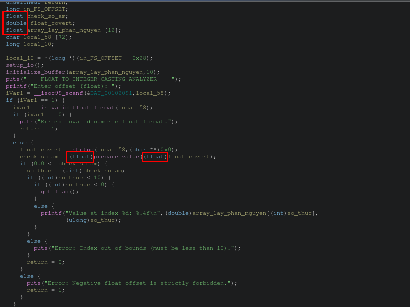
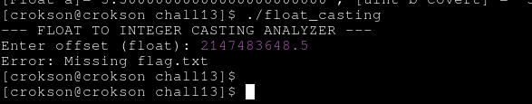
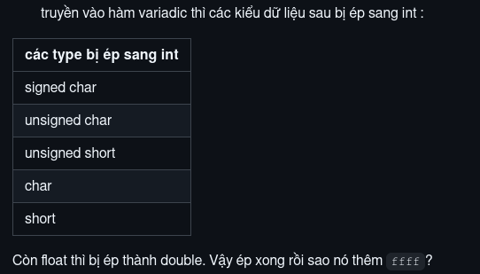

# Chall13 : Float casting

**index**

- [1.Số thực khi ép kiểu sang số nguyên xảy ra hiện tượng gì?](#1số-thực-khi-ép-kiểu-sang-số-nguyên-xảy-ra-hiện-tượng-gì)

- [2.Phân tích hàm lệnh và condiction của đoạn decompile](#2phân-tích-hàm-lệnh-và-condiction-của-đoạn-decompile)

- [3.Giải chall13](#3giải-chall13)

	- [3.1.Vì sao lại có thể giải được chall13](#31vì-sao-lại-có-thể-giải-được-chall13)

---

## 1.Số thực khi ép kiểu sang số nguyên xảy ra hiện tượng gì?

hiện tượng ép kiểu số thực sang số nguyên giống cơ chế làm tròn [round toward zero](https://github.com/tranquanghao708/CSAPP-learning/blob/main/writeup/floating-point_number/writeup.md#34round-toward-zero). Cụ thể, khi số thực vô biến float như `3.9` nhưng khi ép kiểu sang `int` hay hệ số ko dấu `unsigned int` thì nó sẽ là `3` nhưng nếu ép lại sang float thì sẽ xảy ra hiện tượng mất độ chính xác như `3.0` thay vì `3.9`:

<div align="center">

| số thực gốc | sau khi ép sang int | sau khi ép lại sang float |
|-|-|-|
| 3.9 | 3 | 3.0 |
| 1.2 | 1 | 1.0 |
| 9.9 | 9 | 9.0 |

> xảy ra hiện tượng mất độ chính xác khi ép lại sang float

</div>

## 2.Phân tích hàm lệnh và condiction của đoạn decompile

khi vô ghidra ta có `check_so_am = (float)prepare_value((float)float_covert);`, nhưng khi vào hàm `prepare_value()` ta thấy :

```c
undefined4 prepare_value(undefined4 param_1)

{
  return param_1;
}
```

Nghiã là `undefined4` là kiểu dữ liệu `int`. Vì sao ta lại biết nó là `int`, vì `int` chiếm xác suất cao nhất trong phần `undefined4` ta thấy tổng quan chương trình có float, có int đều được xác đinhj sẵn, như ảnh dưới :

<p align="center">
	
</p>

Nhưng nếu cho phần ko xác định kiểu dữ liệu này là int hay float, cũng ko quan trọng vì tổng thể chương trình mà nói, nó cũng sẽ lấy phần nguyên vì các câu điều kiện sau cơ chế kiểm tra số âm đều được ép thành int hết. Như code:

```c
      if (0.0 <= check_so_am) {					// check số âm
        so_thuc = (uint)check_so_am;			// đây là phần ép sang int
        if ((int)so_thuc < 10) {
          if ((int)so_thuc < 0) {
            get_flag();
          }
          else {
            printf("Value at index %d: %.4f\n",(double)array_lay_phan_nguyen[(int)so_thuc],
                   (ulong)so_thuc);
          }
        }
```

điều kiện để có thể lấy flag được nghĩa là hàm gọi `get_flag()` ta cần bypass condiction check số âm và cho số âm bypass hai condiction bên dưới

## 3.Giải chall13

payload : 2147483648.5 (vượt tmax của 32bits)

<p align="center">
	
</p>

### 3.1.Vì sao lại có thể giải được chall13

vì payload `2147483648.5` là vượt tmax của 32bits, rõ là như sau, đầu tiên khi qua condition check số âm, nó là số thực ko âm vì định dạng số thực khác với số nguyên bù hai (khác ở sign | exponent | fraction) nên vượt qua cơ chế check số âm. Lý do có thể là kiểu được ép sang kiểu cao cấp hơn cụ thể compiler rules là ép `float -> double` khi biên dịch:

<p align="center">
<kbd>



</kbd>

> nguồn tại [two complement code CSAPP](https://github.com/tranquanghao708/CSAPP-learning/blob/main/writeup/two-complement-code/two-complement-code.md#m%C3%A3-b%C3%B9-hai)

</p>

Nhưng khi tới các condition bên dưới, nó lại được ép kiểu sang int, vì đây là vượt tmax 32bits nhưng int cũng là 32bits, nên `MSB = 1` là số âm cao nhất nên vượt qua hai condiction và khởi chạy gọi hàm flag