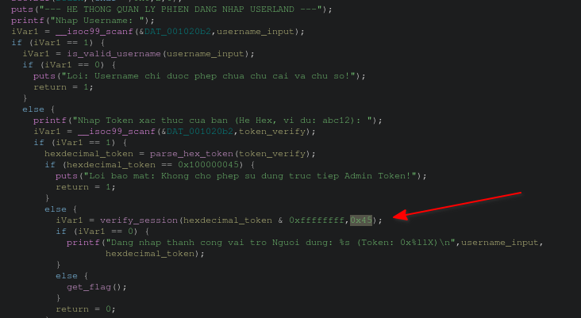
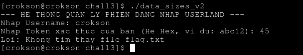

# Writeup : chall3

**index**

- 1.debug condition

- 2.Generating và lấy flags

---

## 1.debug condition

- ghidra show :



- Ta thấy :

```c
          iVar1 = verify_session(hexdecimal_token & 0xffffffff,0x45);
          if (iVar1 == 0) {
            printf("Dang nhap thanh cong vai tro Nguoi dung: %s (Token: 0x%llX)\n",username_input,
                   hexdecimal_token);
          }
          else {
            get_flag();
          }
```

get_flag chỉ chạy khi nó khác 0, bây giờ để khác 0 ta chỉ cần copy đúng 0x45 là dịch ra là 69 trong số nguyên và gán vào thôi, còn hexdecimal_token & 0xffffffff thực chất chỉ lấy tất cả các bit, nghĩa là nó vẫn giữ nguyên nó theo chuỗi 32bits

## 2.Generating và lấy flags

- Nhap Username: crokson

- Nhap Token xac thuc cua ban (He Hex, vi du: abc12): 45

