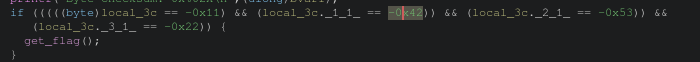
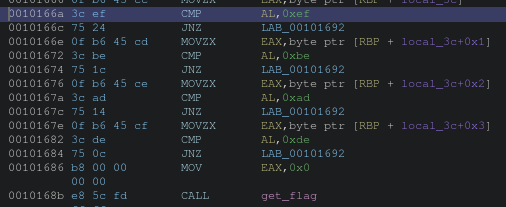
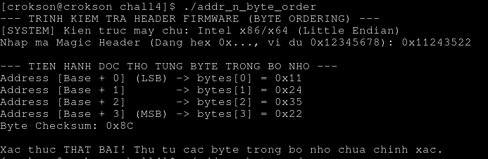
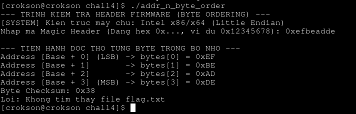

# Writeup : chall4

**mục lục**

- 1.condition dưới deassembly

- 2.xác định quy luật của program

- 3.Generating payload và lấy flags

---

## 1.condition dưới deassembly

- pseudo code C của target condition chính mà chúng ta cần phá :

- hợp ngữ :

- ta thấy nó so sánh lần lượt với 0xef ,0xbe ,0xad ,0xde suy ra nó là kết quả của verify

## 2.xác định quy luật của program

- program chạy test thử :

ta thấy quy luật là nó copy từng byte của hexdecimal đọc giống big endian gán vào phần tử address [base + offset]. đầu tiên là `11` cho LSB cho lần lượt tới `22` cho MSB

## 3.Generating payload và lấy flags

- Dựa vào hợp ngữ có sẵn kết quả verify và quy luật của program ta có :

payload = 0xefbeadde 

