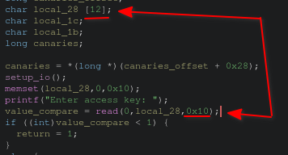
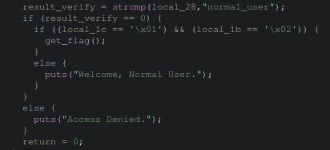
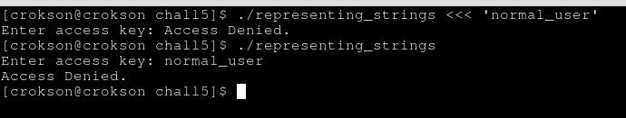
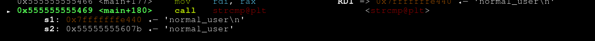
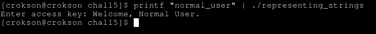
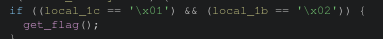
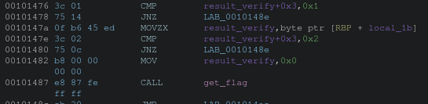
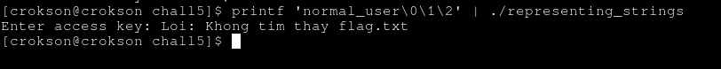

# Writeup : Chall 5

**mục lục**

- 1.debug kiểu read quá số lượng trong program

- 2.phân tích strcmp

- 3.thử một sai lầm vào program và debug với gdb runtime xem flow sequences

- 4.dùng printf shell để transmit exactly sequences vào program tránh newline `\n`

- 5.phân tích condition

- 5.1.xác định vị trí local_1b và local_1c

- 6.generating payload và lấy flags

---

## 1.debug kiểu read quá số lượng trong program

- ta thấy read đọc vượt tới 16 byte trong khi đó array chỉ chứa 12 byte vậy OOB (out of bount) rồi, chưa tới ngưỡng BOF

## 2.phân tích strcmp

- ta thấy payload lần một được hardcode trong program là `normal_user`

## 3.thử một sai lầm vào program và debug với gdb runtime xem flow sequences

- dùng shell trực tiếp vào normal_user, kết quả system thêm newline gây fails và strcmp trả **value $$\large\neq$$ 0**

- debug với gdb, ni tới phần read, nó vào shell input rồi nhập `normal_user` tiếp tục ni tiếp khi tới call strcmp ta có :

- strcmp sai vì newline, rõ ràng nó đã thêm `\n` sau khi enter sequences input vào program

## 4.dùng printf shell để transmit exactly sequences vào program tránh newline `\n`

- để transmit chính xác vào program mà ko bị thêm cái gì vào, ta dùng :

> printf "normal_user" | ./representing_strings

- chính thức qua ải newline, tới ải tiếp theo

## 5.phân tích condition

- condition = `(local_1c == '\x01') && (local_1b == '\x02)`, vậy `local_1c` và `local_1b` = Đã được gán gì đâu? , nhưng nhớ lại read đọc quá vùng array (oob) vậy ta có hypothesis : `"nếu đọc oob, nhớ lại BOF ta ghi đè RIP để return tới hàm win gọi đó là ret2win vậy ở đây nó so sánh \x01 và \x02, khái niệm representing_strings là biểu diễn chuỗi dưới góc nhìn memory vậy thử xác định vị trí local 1c và 1b và gán xem sao"`

#### 5.1.xác định vị trí local_1b và local_1c

- local_1b nằm ở vaddr là `result verify + 0x3` và local1c cũng vậy. Assembly show :

**Vậy proof gì để chứng minh là program sẽ đọc và compare tại vị trí đó? hình stack đâu? :** Chúng ta xét stack sau, dữ kiện có `local_1c` là `rbp - 1c`, `local1b` là `rbp-1b` và `local 28` ở strcmp là `rbp - 28`, theo strcmp nó đọc lần lượt từ sequences có **vaddr cao nhất** trong phạm vi lần lượt tới sequences có **vaddr thấp nhất** (RBP sẽ giảm theo lần lượt), vì stack ground down vadđr thấp nhất là RSP vậy nên RBP-28 là điểm đầu của `normal_user` là character `n` lần lượt tới character `r` tính nullbyte tổng cộng 12 byte vậy `rbp-0x28 - 0xc = 0x1c`, tính lại lần lượt là `0x1c - 0x1 = 0x1b` và `0x1c` (giữ nguyên) hai local 1c và 1b ở đây. Suy ra : `0x1b - 0x1 (offset)` và `0x1c (giữ nguyên)` nên nếu tính null byte `abc...\0 (12byte) thì \1\2` cho `(local_1c == '\x01') && (local_1b == '\x02'`, `0x1c` giữ nguyên nên đọc `\1` trước và `0x1b` trừ 1 offset, stack ground down nên đọc sau `1c` là `\2`. Cơ chế read() là hàm lệnh đọc raw, khác với printf chi tiết hơn [tại đây](https://github.com/tranquanghao708/WriteUp-Pwn/blob/main/WriteUp-submit-task/read/writeup.md)

> lưu ý : decimal và hexdicimal là hai cái **RấT DỄ NHẦM LẪN** nên lưu ý `a -> f` nếu làm việc với hex

#### 6.generating payload và lấy flags

- Trước hết, strcmp chỉ read sequences khi nó gặp null byte `\0` là dừng, nhưng read đọc oob ở array thì việc đầu tiên là phải thêm nullbyte trước cho dừng strcmp đi, xong mới tới payload là `\1` và `\2`

> payload = normal_user\0\1\2

