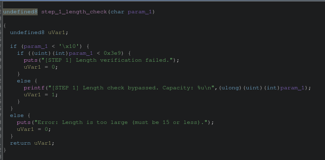
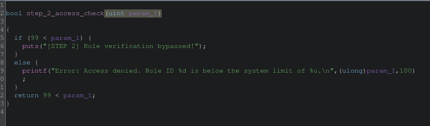
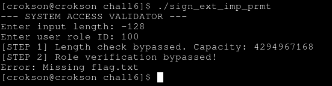
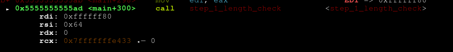

# writeup : chall 6

**mục lục**

- 1.sign extension và zero extension là gì?

- 2.debug hai hàm check compare trong program

- 3.generating và lấy flags

---

## 1.sign extension và zero extension là gì?

- sign extension là việc kéo binary strings ra sau khi type casting cao hơn điều kiện là MSB = 1, nó sẽ kéo một dãy 1 ra

- zero extension là việc kéo binary strings ra sau khi type casting cao hơn điều kiện là MSB = 0, nó sẽ kéo một dãy 0 ra

- Chi tiết [tại đây](https://github.com/tranquanghao708/CSAPP-learning/blob/main/writeup/two-complement-code/two-complement-code.md)

## 2.debug hai hàm check compare trong program

Ghidra show:

debug `step_1_length_check` ta thấy phải bé hơn `'\x10'` nhưng lại phải lớn hơn cái số phía dưới đã được casting sang hệ ko dấu. Vậy là phải dùng Tmin $$\large-2^{N-1}$$ cho việc này, khi chạy và ép kiểu lớn hơn là từ char -> int, nó sẽ sign extension ra binary string cao hơn do ko dấu nên sẽ lớn hơn điều kiện phía dưới

debug `step_2_access_check` ta thấy condition là biết ngay kết quả là 100, nhưng nó sẽ zero extension vì ở printf bị casting sang usigned long. Có thể do compiler optimized rồi chứ theo ý người ra đề là đây zero extension

## 3.generating và lấy flags

- char = 8bite , $$\large-2^{8-1}$$ = -128

- 100

	
proof sign extension nếu muốn

- ta dùng gdb để làm chuyện này, mở nó lên và ni, nhập input lúc đầu là -128 lúc sau là 100, và ni tới phần ` call   step_1_length_check `

ta thấy 0x80 = 128 input lúc đầu nhưng đã được sign extension lên `0xfffff80` rồi

