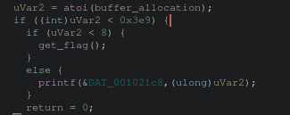
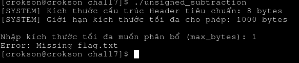

# Writeup : Chall7

**index**

- 1.debug condition

- 2.generating payload và lấy flags

---

## 1.debug condition

ghidra show:

ta thấy nó phải nhỏ hơn cả hai, vậy đơn giản là kết quả có ngay trong đầu

## 2.generating payload và lấy flags

- payload = 1 vì nhỏ hơn cả hai

