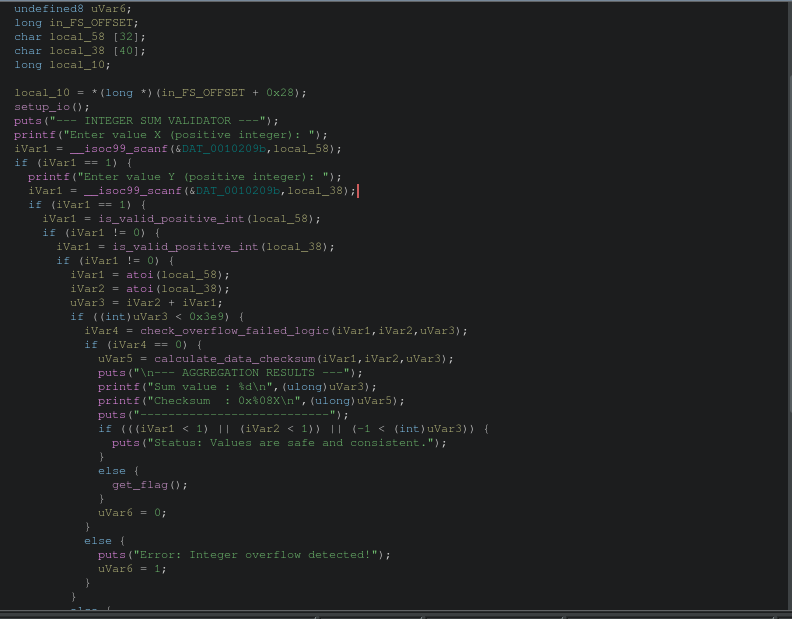
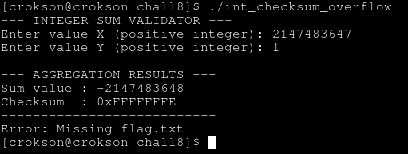

# Writeup : Chall8

**mục lục**

- 1.signed overflow là gì?

- 2.debug condition và clean code

- 3.generating payload và lấy flags

---

## 1.signed overflow là gì?

- là khi vượt tmax giá trị thành âm, vượt tmin thì giá trị thành tmax trở xuống. Ví dụ vượt tmax `0111 + 0001 = 1000 (MSB = 1)` , vượt tmin `1000 + 1000 = 0000 (1carrry)` hoặc `1000 + 1111 = 0111 (tmax)`. Chi tiết [tại đây](https://github.com/tranquanghao708/CSAPP-learning/blob/main/writeup/two-complement-code/two-complement-code.md#tr%C3%A0n-s%E1%BB%91)

## 2.debug condition và clean code

- trước hết phải dọn dẹp code cái đã. Đây là code gốc ở ghidra:



code dọn dẹp :

```c

bool check_overflow_failed_logic(int param_1,int param_2,int param_3)

{
  return 
}

          iVar1 = atoi(local_58);
          iVar2 = atoi(local_38);
          uVar3 = iVar2 + iVar1;
          if ((int)uVar3 < 0x3e9) {

            if () {
				if ( iVar2 != (uVar3 - iVar1) && //iVar phải khác uvar3 - ivar1

					 ((iVar1 < 1) || (iVar2 < 1)) || (-1 < (int)uVar3) //phải false

				   ) {
              		  puts("Status: Values are safe and consistent.");
          		}else {
                	get_flag();
              	}
```

Ta chỉ giữ cái **mấu chốt thực sự trọng tâm** ko lan man, để thực thi hàm `get_flag()` ta phải cho nó ko thể là true ở điều kiện so sánh này `if (((iVar1 < 1) || (iVar2 < 1)) || (-1 < (int)uVar3))` và `iVar2 != (uVar3 - iVar1)`. để tính cái này đơn giản là cho nó vượt Tmax thôi là đủ

## 3.generating payload và lấy flags

- input X = 2147483647 (tmax)

- input Y = 1 (tràn tmax = 2147483647 + 1 = Tmin)

`((2147483647 < 1) || (1 < 1)) || (-1 < -2147483648)` -> False


