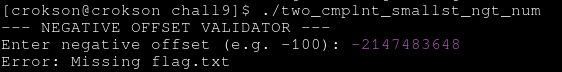

## Writeup: giải bài chall9

**mục lục**

- 1.Tmin là gì và lấy bit với phép toán AND là gì?

- 2.Debugs với Ghidra và phép điều kiện so sánh trong chall

- 3.Khởi tạo payload và lấy Flags

---

# 1.Tmin là gì và lấy bit với phép toán AND là gì?

- Tmin là khi một binary có trọng số âm cao nhất, điển hình khi MSB vừa chạm 1 ví dụ `100000`

- Lấy bit với phép toán AND là AND một dãy binary với `-1` phép toán $$\large2^{N}-1$$ , có thể điều chỉnh lượng bit cần lấy bằng cách tăng độ dài binary 1111 lên, ví dụ muốn lấy 2 bit đầu theo little endian `100110001001 & 0xff = 000000001001`

# 2.Debugs với Ghidra và phép điều kiện so sánh trong chall

> ghidra

vô chall và debug, ta thấy có phép điều kiện gồm hàm lệnh như sau , ta chỉ ngó thứ ta cần thấy để tiết kiệm time :

```c
int my_abs(int param_1)

{
  if (param_1 < 0) {
    param_1 = -param_1;
  }
  return param_1;
}


        uVar1 = my_abs(64bits_number & 0xffffffff);
        if ((int)uVar1 < 1) {
          if (uVar1 == (uint)64bits_number) {
            get_flag();
          }
          else {
            puts("Error: Invalid absolute value conversion.");
          }
        }
        else {
          printf("Processed absolute offset: %d\n",(ulong)uVar1);
        }

```

ta thấy `my_abs(64bits_number_unsigned & 0xffffffff);` thực hiện lấy bit với AND, điều kiện là uvar1 == 64bits_number mới gọi getflag, phân tích logic là khi cung cấp vào là Tmin `100000000..` thì nó lấy nếu có thể chắc chắn giữ bit MSB = 1, và my_abs ko hoạt động và trả về chính nó, khi nhập vào là `10000` myabs trả về vẫn là `10000` vì lấy bit AND giữ MSB lại, suy ra uvar1 là `10000` và 64bits_number là input đầu vào cũng là `10000` hai cái bằng nhau cho ra điều kiện đúng 

# 3.Khởi tạo payload và lấy Flags

> echo $((-2**31))

payload =  -2147483648

